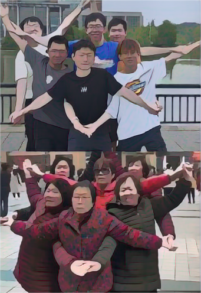
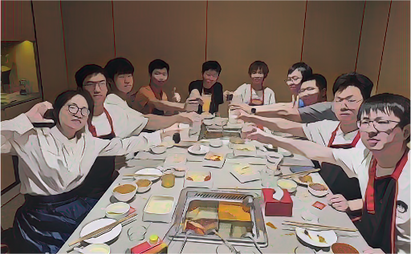

我的日常

实验室的一个老外。这是老师知道当初我想要学英语特意安排到实验室的。可惜的是即使它们在实验室待过的时间长达一年，我也没有把英语学好。

这是我和我实验室的一些同学们， 中间那个就是我。 

一起吃饭，其实坐最中间的本来该是右边那个穿蓝衣服那个，但是由于我低情商的说了一句，xxx你不坐到我们移动端的中间么，然后我就坐到了整个房间的中间位置。不过他们肯定也不会在意这个，因为这么长时间的友谊肯定能允许偶尔的脑抽风

实验室里的学弟学妹，中间还有一只肖桑的犬。 

我是一个被温柔对待的人，因为我无论怎么摆烂，怎么消沉，我的实验室里的老师，学生都没有放弃过我，虽然我很早很早以前就不再插手实验室里的诸多事情，但是他们每时每刻都在治愈我。我觉得这跟虚荣没关系，我只是相对于其他人，刚好
走到了比较正确的路上，因此当我面临 真正的问题时，我还是会退缩。

这是我之前说的贵人老师，现在他把他多租了一年多的房子免费给了我，我所有的，自认为算是成就的一些东西，大部分都离不开他。
即使是这样，我也没有勇气去面对新的生活。
实验室里的一切的一切，还有我的骄傲，在今年4月份之前我都没有向任何人提起过（除了罗江），我的父母也只是知道我待在实验室过。我只想把故事分享给你，其实每个瞬间我都想，你要是在身边就好了，你会是怎样的表情呢。

