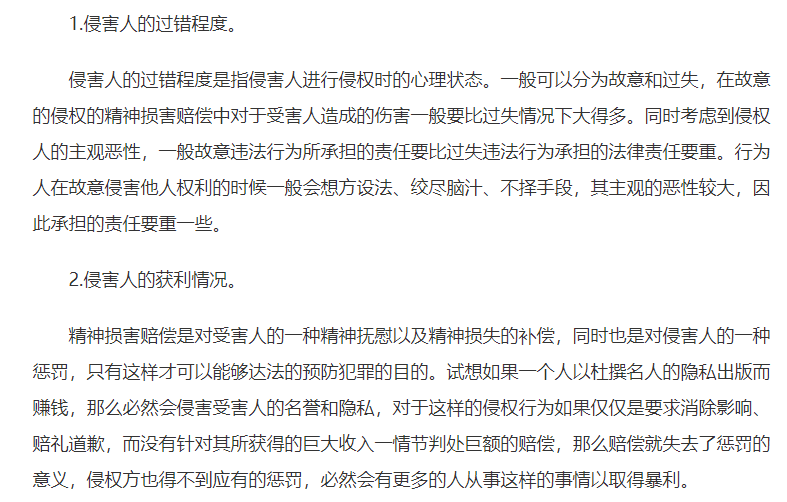
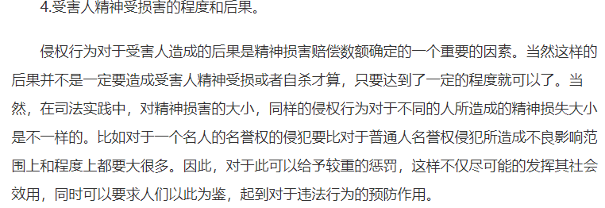
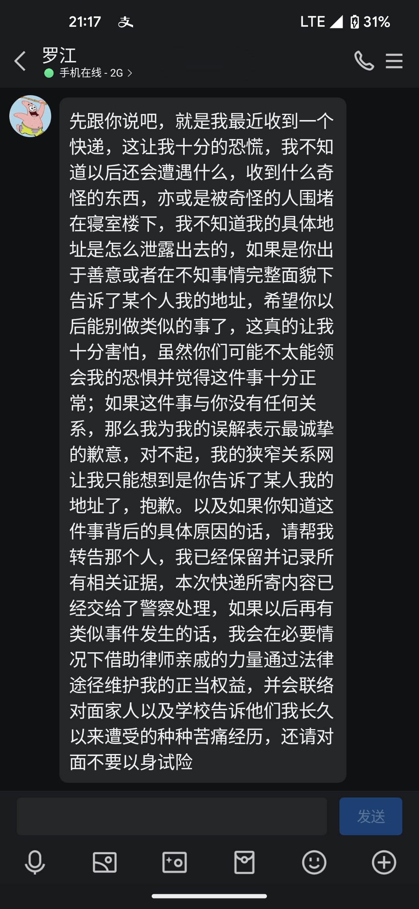

疯批闺蜜

你知道当初我为什么对你的闺蜜，没有发生言语冲突么。因为我本来就认为她所作的一切都是为了你。而且我如果去指责她，去说她对我造成的影响，会损坏到你们的关系，因为我不确定你身边是否只有这一个人关心你，如果我把原因说出来，导致你们宿舍关系不和，可能对你造成十分恶劣的影响。 而我的想法，是她那种充满攻击性的大脑想象不到的。
我觉得你身边有个疯子。我觉得你所有的一切，你自己的想法，你的言语，都是那么温柔，可爱。但是只要和她沾上关系，我就觉得疯狂，不可理解，委屈和痛苦。

事实证明，攻击性的言语确实会导致一个人的自卑，无论我怎么努力，怎么往积极方面考虑，取得怎样的成就，都抵消不了这些东西给我带来的消极影响。这就是我人生停转的全部原因，不是因为你拒绝我而痛苦，我也不会强制让你去喜欢我，理解我，而是我在承受了一年的痛苦之后，不仅没有消除那种自卑，而且又要开启新一轮的痛苦，我的下辈子都不会让这种人再出现在我的视野中。
我根本不想听有关这方面的一点反驳，我知道她肯定有自己的理由，比如为了让一个骚扰犯离开你之类的，而且事实也证明在她面前，我所做的一切都是那么恶心，不可饶恕，但是我懒得多解释一句话，因为我每次解释都会带来新一轮的反驳，然后我又要孤独的，痛苦的去把这种消化不了的情绪压抑在心中，这种争吵是无休止的，无论我怎么想用和平方法解决，都会招致一个更大的耳光，所以我决定不再容忍，认识到自己在做什么吧，我不知道她是否因为男性给他带来过什么创伤，才导致做法是如此极端，但是求求她别把这个东西发泄到现实生活中，事实证明就算我不以极端方式去回应她的极端，所有的伤痛，不理解，沉默都转移到了我们中间，而且她也不用因此背负任何责任。我为自己的整个青春都在去尝试消化一个置身事外的疯子的言语所造成的损害而感到羞愧，我花了两年时间去认识到，宽容和理解在疯子的脑子里是不存在的。我不会为我自己的言语产生任何罪恶感，因为我对自己的惩罚已经够多了，我诅咒她，在每一次为别人提供建议的时候，都需要考虑自己会不会因此毁掉别人的生活，因为她实实在在的毁掉了我的青春，而这中间也可能包含了你的。

所以我作为一个前同学，曾经喜欢过你的人，真心的建议你自己去思考，我在很早以前就发现你很容易受其他人的想法而影响，这可能源于你对自己想法的不自信。但是我可以保证，你温柔，善良，而且说的话比谁都有力量，你按照闺蜜想法所做的一切的责任，你的闺蜜都没有想要去为此负责的迹象。

为了提醒下做的行为她行为有多疯狂，我可以告诉她的言语到底为我带来了什么。

学妹一脸天真的问我，下次答辩是什么时候，我只能沉默。整个实验室40多人，都在讨论学长怎么样，发生了什么。老师质疑我为什么不找工作，不知道我未来到底是要去做什么。甚至在实验室的老外，也语重心长的说，you should look forward. 我每天就处在这种充满期待和压力的眼神中，但是即便如此我还是没有做出任何行为挽回自己的脸面，我做不到。我想问一下，她能够在这种环境下，还面带微笑坚强生活下去吗，她到底要把人折磨到什么地步才能满意，才肯放过我？在受不了精神上的折磨之后，想趁着你的生日进行最后告别。 
罗江其实一点也没做错，他把你们商量后说的解决办法原封不动的给了我。

这确实远远超出了我的预期，一是没想到你还会对我的行为做出反应，二是没想到你会去报警。

我看你可能为此难过，可能会觉得自己做的过火，我知道这是因为你怕我去报复才做出的反应，因为当今社会确实很疯狂，扭曲的人比比皆是，所以这完完全全就是我发疯后的一个疯狂的行为，所有的责任都在于我不该有这个想法。所以我看到你难过的样子，我就去安慰你，去表达我不在乎的感情。但是我迎来的就是更大的耳光。

