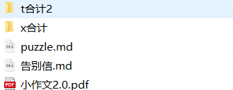
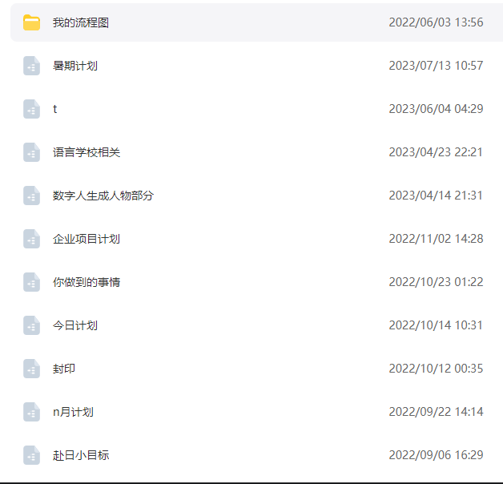

我的爱，和最煎熬的一年

其实我一直想不到什么办法，我的身边也没有任何有过靠谱恋爱经验的人，所以我一直很煎熬，这种煎熬后面也转换成了绝望。 

其实在这条道路上从来没有人支持过我，我所求助的只有三个人，一个是罗江，一个是我的老师，还有之前我给你发的照片的那个老外。

罗江根本没谈过，我的老师希望我能赶紧振作起来，还给我举例了商纣王的故事，他说纣王的爱情故事是绝美的，但是却导致整个国家覆灭。
那个老外则是直接摇摇头给我说：you should move to next one.但是我要如何去move to next one 呢。

在你眼里我是怎样的存在呢，是一直在陪伴你的人，还是一直在你一旁骚扰你的人。 我不知道自己是什么。对我来说你是一个一直让我牵挂的人，
我经历过男生小丑阶段之燕子没有我你一定要幸福啊。在大多数失眠的夜晚，我都因为你是否受到委屈而伤心，还担心你会因为跟所有高中同学相处不好而自卑，
所以还想着一定要修复关系。

但是现在看来我觉得纯逆天，不过这也确实反应了当初最纯真的想法。

所以我无论如何都想知道你过的怎么样，于是就有了之前的找老师计划。

这个puzzle写于23年的7月份，我想着在暑假期间准备一个完美的计划：在老师的介绍下找到你的室友，因为是通过老师传达消息就会消除疑虑。通过
说出心中的疑惑和你的室友沟通，确定你的生活状态，以及了解你的爱好，决定自己是不是该出现，最后在室友帮助下，准备一个惊喜party。
遗憾的事老师爽约了，我唯一可以在不影响你的情况下了解你的方法就这样泡汤了。所以那份担心一直一直持续着。这份担心知道你们打算报警才烟消云散，
至少我排除了最绝望的，被室友排挤的情况。这也是我后面为什么对于自己想对你说的话显得不那么纠缠的原因，不是为了惩罚你，而是我知道你好就已经满足了。

但是我真的非常非常的绝望和无助，我失去了了解你的机会，我所做的努力又一次宣告泡汤。 

你知道我为什么那么执着于KFC那次事情么，不是多想让你说你喜欢我，而是那是我唯一让我回忆起你的机会。整整大学四年，我都没有再见过你。这导致的情况就是，
做的梦一直都是去尝试寻找你的身影，你应该想象不到这种感觉有多糟糕。然后还有很逆天的，之前你说什么男朋友，然后我就做的梦里就在你隐隐约约的身影旁边加了个隐隐约约的男朋友
，em，只能说请你自行体会吧。

我之前还计划过很多东西，包括很多与你共同前进的未来，但是后来我已经想象不到什么未来了，我连自己的未来都无法掌握。
