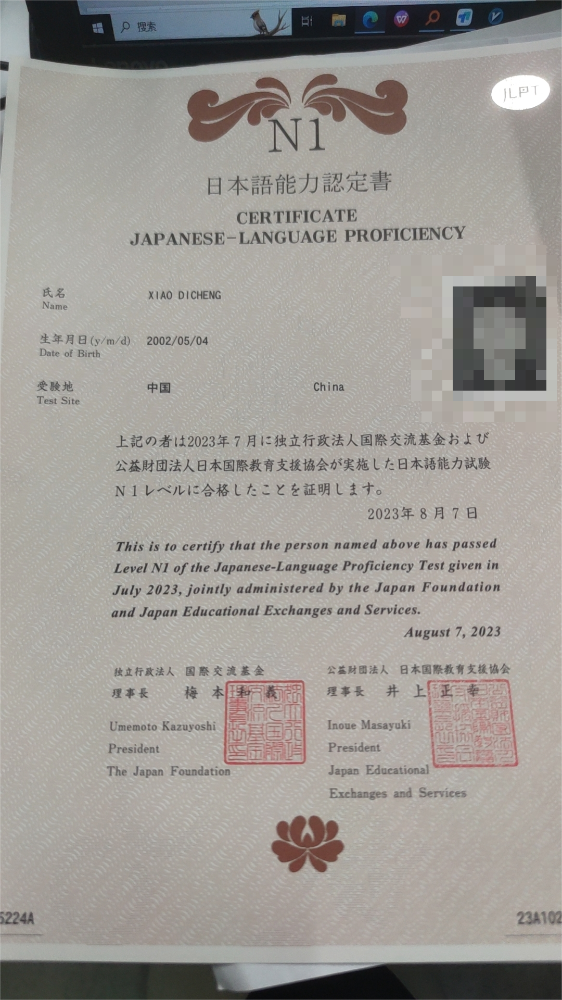

_让我用历史签名来会回忆我们之前发生的所有事情吧。
我的历史个签，在22个历史签名中，21个都是对你说的，所以从某种意义上说是你让我变得稍微外向？？

最开始的这个My heart burning。。。(现在看来好羞耻),也是我们矛盾的起点，就是班里一个女生向我表白。

这个女生后面经常跑到我们实验室，她是一个乐观开朗的女孩，没有因为我拒绝而过多伤心，飞速的向我们班下一位男生发起了攻势，就在前几天她表白又失败了，但是还是一如既往的乐观。

5月大概是希望你能发现我不敢加你了然后发的个签，9月那个是因为很绝望了发的个签。
现在想想，当初难过的最主要原因就是以为被突然直接结束了，要不是有一个借口让我去再找你，或许早就结束了吧。所以为什么一直去点你的空间，尝试在其他你能看的见的地方引起你注意，
主要目的就是想让你告诉我，让我去弥补，给我一个机会。但是直到我23年3月这种情况都没有出现，所以就以及其心虚的心态去加了你，然后就理所当然的被拜拜了。
这份以为已经结束，但是其实没有结束的心态也体现在了23年12月份，也就是看到你不想回我消息之后我也就没有过多纠缠，因为我一直是这么想的。

这个再等等就是我已经取得一定成就的时候才自信发出来的话，我一直在想着怎么样才能更好的表现自己,于是我想到了吉他（但是一直没学好，我的朋友很震惊我跟着书学了很久）。现在应该有个一年多没碰那个了吧。我还之前还跟你说我要学日语来着。 
唐ちゃんすごくかわいい！一直想用纯正大佐音告诉你来着。其实22年7月我就考了一次了，但是当时因为给黑心实验室老师打工导致听力的时候睡觉，因为疫情耽误了一年以后才过。

好想被你夸奖啊，我从那时开始就这么想象着。

这些是我被你拒绝后，大脑开始出现问题的时期，具体为什么这么难过后面会解释，跟被拒绝的关系不是很大，其实很早之前，在大约大二的暑假，也就是我说再等等之前的时候我就察觉了自己的异样，比如说走在路上也会莫名其妙的哭泣。

后面的也就是最近才发生的事情，后面再讨论吧。_
