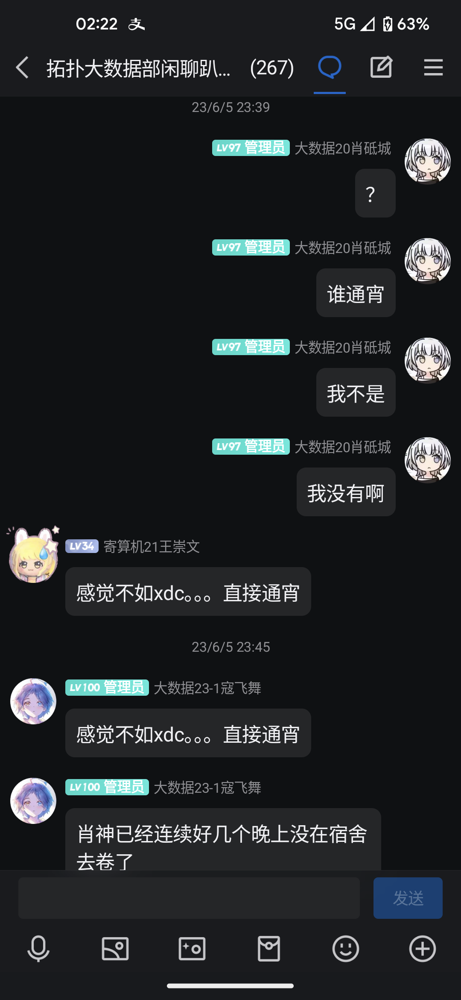
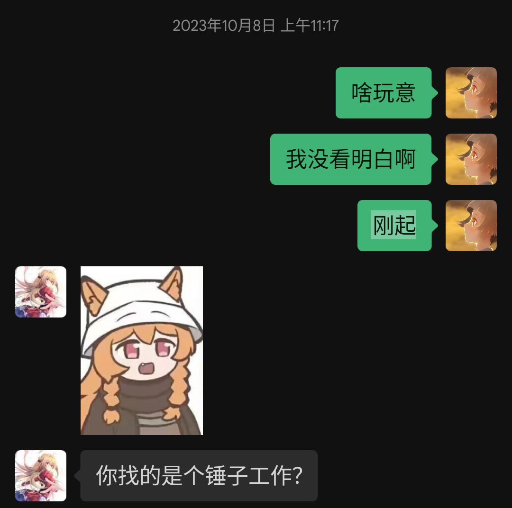

我的摆烂

到了23年3月份以后，也就是进入我摆烂全盛期

23年6月份，已经很久没有在白天醒来过，将近1个月内没有任何社交，基本没说过几句话，没有正常上过课。

23年9月，打着秋招的幌子回家去玩游戏，那时候还是有很多份工作机会向我招手，因为我在很久之前的努力，就算放到大四毕业生中间也是足够优秀的。
但是我并没有意向去争取（咕咕了几乎所有笔试和面试）。 后面剧情也差不多12月写信，答应你的闺蜜不再纠缠，然后开始新一轮摆烂。3月回到学校打着春招幌子继续玩游戏，被不止一个人当面说感觉你精神不正常。
我连最后的尊严都没有被留下，我最不想看到，也最不想承认的事情就是这个，虽然说我不至于到医院被诊断为精神病的地步（事实上我也没去过），但是已经意识到，我可能需要的不止是简单的放松，
但是就连怎么去放松心情，我也没有一个好的方法，我只会像个宅男一样，不停把自己关起来打游戏。

我不想再去回忆这段昏暗的时刻，我也记不起来我到底在这段时间做了什么东西，为数不多能安慰到我精神的，就只有我身边的同伴了。
