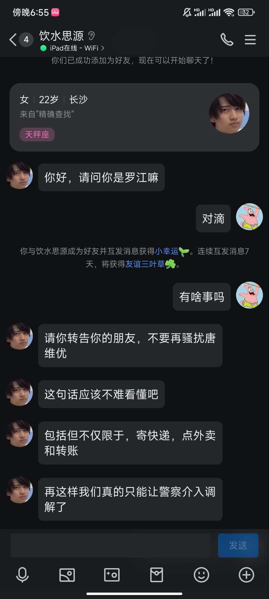

对我而言，答案很简单，就是告诉我，我在看着你。 但是这一年里我从来没有发现过你的任何痕迹。其实我根本没有找到过答案，我一直都在猜测，一直在。

现在想起来我为何会痛苦了，可能原因就是希望有人告诉我，还没有结束，我还有机会去挽回，最起码是告别。

关于那封信？  其实我早就看到了你的回应，但是我根本不知道怎么去反应，于是我停止了思考，在那三个月内大脑一直都处于放空状态。

这封2023年7月的信是写给老师看的，现在不曾想已经过去了一年了啊。 

关于计划

其实到这里我就已经近乎发疯

疯子

我无承受，也无法消化这些垃圾情绪。所以求你让她放过我，别再插手了。

这是我的生活
